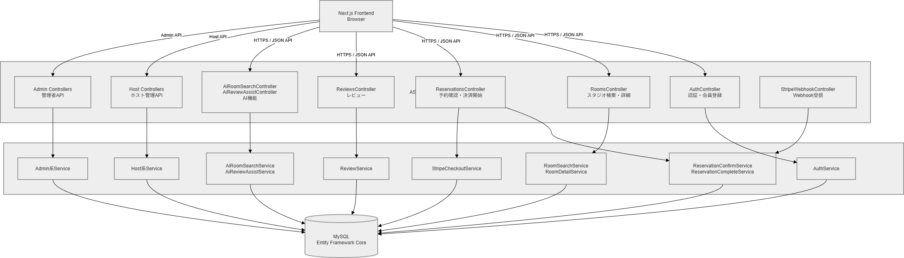
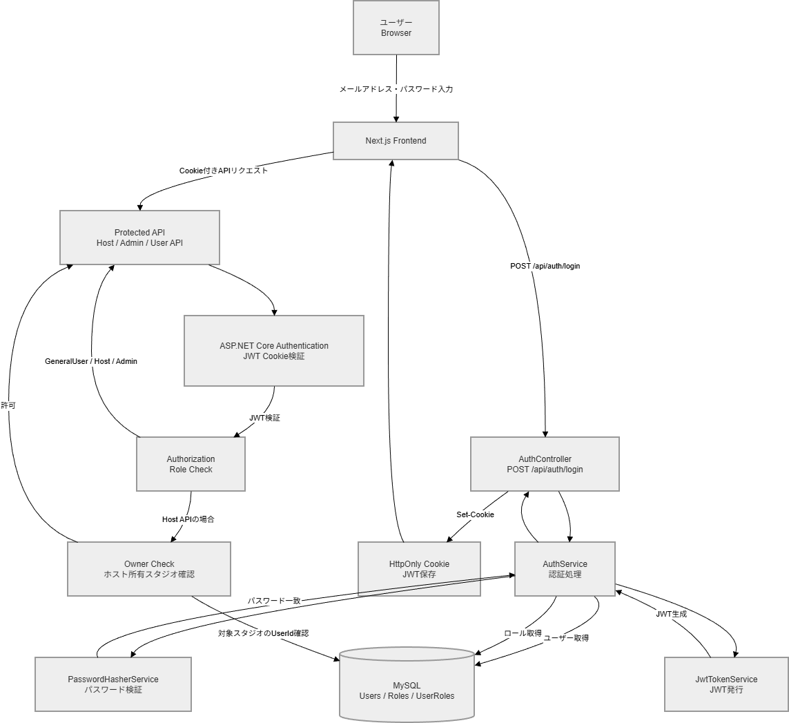
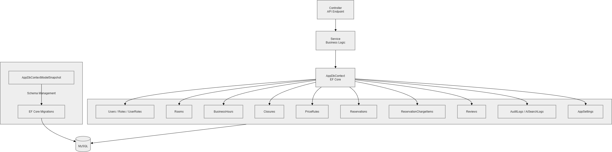

# Studio Book Backend

**Studio Book Backend** は、スタジオ時間貸し予約サービス **Studio Book** のバックエンド API です。

ASP.NET Core Web API・Entity Framework Core・MySQL を使用し、認証・スタジオ検索・予約・Stripe 決済・レビュー・ホスト管理・管理者機能・AI 検索・ログ管理を提供します。

---

## 概要

このバックエンドは、Next.js フロントエンドから呼び出される REST API として動作します。

主な役割は以下のとおりです。

- 会員登録 / ログイン / メール認証
- JWT Cookie 認証・ロール別認可
- スタジオ検索 / 詳細取得
- 予約確認 / 料金計算
- Stripe Checkout セッション作成
- Stripe Webhook による予約確定
- レビュー投稿 / レビュー管理
- ホスト向けスタジオ管理
- ホスト向け予約・売上・統計管理
- 管理者向けユーザー・スタジオ・予約・ログ管理
- OpenAI API を利用した AI 自然文検索 / レビュー補助
- 監査ログ / AI 検索ログの保存
- CSV / PDF 出力
- xUnit による Controller / Service テスト

---

## 技術スタック

| 技術 | 用途 |
|---|---|
| ASP.NET Core 8 Web API | API サーバー |
| C# | バックエンド実装 |
| Entity Framework Core | ORM / DB アクセス |
| MySQL | データベース |
| Pomelo.EntityFrameworkCore.MySql | EF Core MySQL Provider |
| JWT Bearer Authentication | 認証 |
| Cookie Authentication | JWT Cookie 管理 |
| ASP.NET Core Authorization | ロール別認可 |
| ASP.NET Core RateLimiter | AI 検索などのレート制限 |
| Stripe API | 決済連携 |
| QuestPDF | PDF 生成 |
| OpenAI API | AI 検索 / レビュー補助 |
| Mailtrap | メール送信確認 |
| xUnit | テスト |
| Moq | モック作成 |
| EF Core InMemory | テスト用 DB |
| Swagger | API 仕様確認 |
| Docker Compose | ローカル MySQL 環境 |
| Heroku | API デプロイ |
| JawsDB MySQL | 本番想定 DB |

---

## ディレクトリ構成

```text
Backend
├─ docker-compose.yml
├─ README.md
├─ Studiobook_backend.sln
│
├─ Studiobook_backend
│  ├─ Controllers
│  ├─ Data
│  ├─ Dtos
│  ├─ Entities
│  ├─ Migrations
│  ├─ Seeders
│  ├─ Services
│  ├─ Settings
│  ├─ Fonts
│  ├─ Program.cs
│  ├─ appsettings.json
│  ├─ Procfile
│  └─ Studiobook_backend.csproj
│
└─ Studiobook_backend.Tests
   ├─ Controllers
   ├─ Services
   ├─ Helpers
   └─ Studiobook_backend.Tests.csproj
```

---

## アーキテクチャ概要

```
[Next.js Frontend]
        │
        │ HTTPS / JSON API
        ▼
[ASP.NET Core Web API]
        │
        ▼
   [Controller]
        │
        ▼
    [Service]
        │
        ▼
[AppDbContext / Entity Framework Core]
        │
        ▼
     [MySQL]
```

**外部サービス連携:**

```
[ASP.NET Core Web API]
   ├─ Stripe Checkout / Webhook
   ├─ OpenAI API
   └─ Mailtrap
```

---

## API 構成

Backend は用途ごとに Controller を分けています。



### 主な Controller

| Controller | 概要 |
|---|---|
| AuthController | 会員登録・ログイン・ログアウト・メール認証・パスワード再設定 |
| HomeController | トップページ表示用データ |
| RoomsController | スタジオ一覧・詳細 |
| ReservationsController | 予約確認・Checkout 開始・予約一覧 |
| ReviewsController | レビュー一覧・レビュー投稿 |
| StripeWebhookController | Stripe Webhook 受信 |
| AiRoomSearchController | AI 自然文スタジオ検索 |
| AiReviewAssistController | AI レビュー文補助 |
| HostRoomsController | ホスト向けスタジオ管理 |
| HostBusinessHoursController | ホスト向け営業時間管理 |
| HostClosuresController | ホスト向け休館日管理 |
| HostPriceRulesController | ホスト向け料金ルール管理 |
| HostReservationsController | ホスト向け予約管理 |
| HostSalesController | ホスト向け売上管理 |
| HostSalesCsvController | ホスト向け CSV 出力 |
| HostSalesExportController | ホスト向け PDF 出力 |
| HostStatusController | ホスト向け統計 |
| HostReviewsController | ホスト向けレビュー管理 |
| AdminUsersController | 管理者向けユーザー管理 |
| AdminRoomsController | 管理者向けスタジオ管理 |
| AdminReservationsController | 管理者向け予約管理 |
| AdminSettingsController | 管理者向けシステム設定 |
| AdminStatusController | 管理者向けデータ一覧 |
| AdminAuditLogsController | 管理者向け監査ログ |
| AdminAiSearchLogsController | 管理者向け AI 検索ログ |

### 代表的な API エンドポイント

#### 認証

| Method | Endpoint | 概要 |
|---|---|---|
| POST | `/api/auth/signup` | 会員登録 |
| POST | `/api/auth/login` | ログイン |
| POST | `/api/auth/logout` | ログアウト |
| GET | `/api/auth/me` | ログイン中ユーザー取得 |
| GET | `/api/auth/verify` | メール認証 |
| POST | `/api/auth/forgot-password` | パスワード再設定メール送信 |
| POST | `/api/auth/reset-password` | パスワード再設定 |

#### 一般ユーザー

| Method | Endpoint | 概要 |
|---|---|---|
| GET | `/api/home` | トップページ用データ取得 |
| GET | `/api/rooms` | スタジオ一覧 |
| GET | `/api/rooms/{roomId}` | スタジオ詳細 |
| POST | `/api/reservations/confirm` | 予約内容確認 |
| POST | `/api/reservations/checkout` | Stripe Checkout セッション作成 |
| GET | `/api/reservations` | 自分の予約一覧 |
| GET | `/api/rooms/{roomId}/reviews` | レビュー一覧 |
| POST | `/api/rooms/{roomId}/reviews` | レビュー投稿 |

#### AI

| Method | Endpoint | 概要 |
|---|---|---|
| POST | `/api/ai/room-search` | AI 自然文スタジオ検索 |
| POST | `/api/ai/review-assist` | AI レビュー文補助 |

#### ホスト

| Method | Endpoint | 概要 |
|---|---|---|
| GET | `/api/host/rooms` | 自分のスタジオ一覧 |
| GET | `/api/host/rooms/{roomId}` | スタジオ詳細 |
| GET / PUT | `/api/host/rooms/{roomId}/business-hours` | 営業時間取得 / 更新 |
| GET / POST | `/api/host/rooms/{roomId}/closures` | 休館日取得 / 登録 |
| DELETE | `/api/host/rooms/{roomId}/closures/{closureId}` | 休館日削除 |
| GET / POST | `/api/host/rooms/{roomId}/price-rules` | 料金ルール取得 / 登録 |
| GET | `/api/host/reservations` | 予約一覧 |
| GET | `/api/host/sales` | 売上一覧 |
| GET | `/api/host/sales/{id}` | 売上詳細 |
| GET | `/api/host/sales.csv` | 売上 CSV 出力 |
| GET | `/api/host/status` | 統計情報 |
| GET | `/api/host/reviews` | レビュー一覧 |

#### 管理者

| Method | Endpoint | 概要 |
|---|---|---|
| GET | `/api/admin/users` | ユーザー一覧 |
| GET | `/api/admin/users/{id}` | ユーザー詳細 |
| GET | `/api/admin/rooms` | スタジオ一覧 |
| GET | `/api/admin/rooms/{id}` | スタジオ詳細 |
| POST | `/api/admin/rooms` | スタジオ登録 |
| PUT | `/api/admin/rooms/{id}` | スタジオ更新 |
| GET | `/api/admin/reservations` | 予約一覧 |
| GET | `/api/admin/settings` | システム設定取得 |
| PUT | `/api/admin/settings` | システム設定更新 |
| GET | `/api/admin/logs` | 監査ログ一覧 |
| GET | `/api/admin/ai-search-logs` | AI 検索ログ一覧 |
| GET | `/api/admin/status` | 管理者データ一覧 |

---

## 認証・認可

ログイン成功時に JWT を発行し、HttpOnly Cookie に保存します。以降の API リクエストでは Cookie を通じて認証状態を判定します。



### 主なロール

| ロール | 説明 |
|---|---|
| GeneralUser | 一般ユーザー |
| Host | スタジオ提供者 |
| Admin | 管理者 |

### 認可方針

| 区分 | 方針 |
|---|---|
| 一般ユーザー | 自分の会員情報・予約情報のみ操作可能 |
| ホスト | Host ロールが必要 |
| 管理者 | Admin ロールが必要 |

### ホスト所有者チェック

ホスト系 API では、ロールだけでなく**対象スタジオの所有者チェック**を行います。

```
ログインユーザー ID
       ↓
対象スタジオの UserId と照合
       ↓
一致する場合のみ操作を許可
```

これにより、他ホストのスタジオ情報・営業時間・休館日・料金ルール・予約・売上を操作できないよう保護しています。

---

## DB アクセス構成

Entity Framework Core を使用し、`AppDbContext` 経由で MySQL にアクセスします。



### 主な Entity

| Entity | 概要 |
|---|---|
| User | ユーザー情報 |
| Role | ロール情報 |
| UserRole | ユーザーとロールの中間テーブル |
| Room | スタジオ情報 |
| BusinessHour | 営業時間 |
| Closure | 休館日 |
| PriceRule | 料金ルール |
| Reservation | 予約 |
| ReservationChargeItem | 予約料金明細 |
| Review | レビュー |
| VerificationToken | メール認証トークン |
| PasswordResetToken | パスワード再設定トークン |
| AppSetting | システム設定 |
| AuditLog | 監査ログ |
| AiSearchLog | AI 検索ログ |

### ER 図


---

## 予約・決済処理

予約は、予約確認 → 料金計算 → Stripe Checkout → Webhook 受信 → 予約確定の順で処理します。


### 処理の流れ

```
スタジオ詳細
    ↓
予約入力
    ↓
予約内容確認
    ↓
料金計算
    ↓
Stripe Checkout Session 作成
    ↓
Stripe 決済
    ↓
Webhook 受信
    ↓
予約確定
    ↓
予約一覧へ反映
```

### 主な Service

| Service | 概要 |
|---|---|
| ReservationConfirmService | 予約内容確認・営業時間・休館日・既存予約チェック・料金計算 |
| StripeCheckoutService | Stripe Checkout Session 作成 |
| ReservationCompleteService | Webhook 受信後の予約確定処理 |
| HostReservationService | ホスト向け予約管理 |
| UserReservationService | 一般ユーザー向け予約一覧 |

### 料金明細

予約金額は `Reservations` だけでなく、`ReservationChargeItems` に明細として保存します。

主な明細項目：通常料金 / 時間帯別料金 / 税 / プラットフォーム手数料

これにより、予約後に料金内訳や売上明細を確認できます。

---

## AI 機能

OpenAI API を利用して、AI 自然文スタジオ検索とレビュー文補助を実装しています。

### AI 自然文スタジオ検索

ユーザーが自然文で入力した条件を AI が解釈し、スタジオ検索条件に変換します。

**入力例:**
```
落ち着いた雰囲気で、夜に使える撮影向けのスタジオを探したい
```

**AI が解釈する主な条件:** 用途 / 雰囲気 / エリア / 予算 / 人数 / 時間帯 / キーワード

### AI レビュー文補助

ユーザーが入力した感想文を、自然なレビュー文に整えます。生成文はそのまま投稿されず、ユーザーが確認・修正してから投稿します。

### AI ログ

AI 検索の利用状況は `AiSearchLogs` に保存します。記録内容：検索文 / IP アドレス / ユーザー ID / 使用モデル / 成功・失敗 / 結果件数 / エラー内容

---

## ログ設計

### 監査ログ

`AuditLogs` に管理操作や重要イベントを記録します。記録対象の例：ログイン / 管理者操作 / 予約操作 / 設定変更

### AI 検索ログ

`AiSearchLogs` に AI 検索の利用履歴を保存します。管理者画面から検索文・結果件数・成功/失敗・エラー内容などを確認できます。

---

## CSV / PDF 出力

ホスト向け売上管理では、CSV 出力と PDF 出力に対応しています。

| 出力 | 概要 |
|---|---|
| CSV | 売上一覧のエクスポート |
| PDF | 売上詳細の帳票出力 |

PDF 生成には **QuestPDF** を使用します。

---

## ローカル開発環境

### 前提

- .NET 8 SDK
- Docker Desktop
- Git
- Stripe CLI（Webhook 確認時）
- OpenAI API Key（AI 機能確認時）

### 起動手順

**1. MySQL 起動**

```bash
cd Backend
docker compose up -d
```

**2. Backend 起動**

```bash
cd Backend/Studiobook_backend
dotnet restore
dotnet ef database update
dotnet run
```

API は以下で起動します。

```
https://localhost:7226
```

Swagger を有効化している場合：

```
https://localhost:7226/swagger
```

---

## 環境変数・シークレット管理

API キーや接続情報は Git 管理しません。本物の値は User Secrets または環境変数で管理します。

### User Secrets 設定例

```bash
dotnet user-secrets set "Jwt:SigningKey" "your-real-jwt-signing-key"
dotnet user-secrets set "OpenAI:ApiKey" "your-openai-api-key"
dotnet user-secrets set "Stripe:SecretKey" "your-stripe-secret-key"
dotnet user-secrets set "Stripe:WebhookSecret" "your-stripe-webhook-secret"
```

### 主な設定項目

| Key | 用途 |
|---|---|
| `ConnectionStrings:DefaultConnection` | DB 接続文字列 |
| `Jwt:Issuer` | JWT 発行者 |
| `Jwt:Audience` | JWT 利用者 |
| `Jwt:SigningKey` | JWT 署名キー |
| `Jwt:AccessTokenMinutes` | JWT 有効期限 |
| `Stripe:SecretKey` | Stripe Secret Key |
| `Stripe:PublishableKey` | Stripe Publishable Key |
| `Stripe:WebhookSecret` | Stripe Webhook Secret |
| `Stripe:SuccessUrl` | 決済成功時 URL |
| `Stripe:CancelUrl` | 決済キャンセル時 URL |
| `OpenAI:ApiKey` | OpenAI API Key |
| `Frontend:BaseUrl` | フロントエンド URL |
| `Mailtrap:Host` | Mailtrap ホスト |
| `Mailtrap:Port` | Mailtrap ポート |
| `Mailtrap:From` | 送信元メールアドレス |

### Stripe Webhook 確認

ローカルで Stripe Webhook を確認する場合は Stripe CLI を使用します。

```bash
stripe listen --forward-to https://localhost:7226/api/stripe/webhook
```

Webhook Secret を取得し、User Secrets または環境変数に設定します。

```bash
dotnet user-secrets set "Stripe:WebhookSecret" "whsec_xxx"
```

---

## テスト

Backend では xUnit を使用し、Controller / Service 単位のテストを実装しています。

### テスト実行

```bash
cd Backend
dotnet test
```

またはソリューション単位で実行：

```bash
cd Backend/Studiobook_backend
dotnet test ../Studiobook_backend.Tests/Studiobook_backend.Tests.csproj
```

### 主なテスト対象

**Controller Tests**

AuthControllerTests / HomeControllerTests / RoomsControllerTests / ReservationsControllerTests / ReviewsControllerTests / StripeWebhookControllerTests / AiRoomSearchControllerTests / AiReviewAssistControllerTests / HostRoomsControllerTests / HostBusinessHoursControllerTests / HostClosuresControllerTests / HostPriceRulesControllerTests / HostReservationsControllerTests / HostSalesControllerTests / HostSalesCsvControllerTests / HostSalesExportControllerTests / HostStatusControllerTests / HostReviewsControllerTests / AdminUsersControllerTests / AdminRoomsControllerTests / AdminReservationsControllerTests / AdminSettingsControllerTests / AdminStatusControllerTests / AdminAuditLogsControllerTests / AdminAiSearchLogsControllerTests

**Service Tests**

AuthServiceTests / JwtTokenServiceTests / PasswordHasherServiceTests / VerificationTokenServiceTests / PasswordResetServiceTests / EmailServiceTests / HomeServiceTests / RoomSearchServiceTests / RoomDetailServiceTests / ReservationConfirmServiceTests / ReservationCompleteServiceTests / UserReservationServiceTests / ReviewServiceTests / StripeCheckoutServiceTests / AiRoomSearchServiceTests / AiReviewAssistServiceTests / AiSearchLogServiceTests / AuditLogServiceTests / HostBusinessHourServiceTests / HostClosureServiceTests / HostPriceRuleServiceTests / HostReservationServiceTests / HostSalesServiceTests / HostStatusServiceTests / HostReviewServiceTests / AdminUserServiceTests / AdminRoomServiceTests / AdminReservationServiceTests / AdminSettingsServiceTests / AdminStatusServiceTests / AdminAuditLogServiceTests / AdminAiSearchLogServiceTests

### テスト方針

| 区分 | 方針 |
|---|---|
| Controller Test | HTTP レスポンス・認可結果・例外時レスポンスを確認 |
| Service Test | 業務ロジック・DB 更新・計算処理・異常系を確認 |
| EF Core InMemory | DB を使う Service テストで利用 |
| Moq | 外部依存や Service 依存の置き換えに利用 |

---

## CI

GitHub Actions により、push / pull request 時に Backend のビルド・テストを自動実行します。

**ワークフロー:** `.github/workflows/ci-tests.yml`

**実行内容:**

```
.NET restore → .NET build → .NET test
```

---

## デプロイ

Backend は Heroku へのデプロイを想定しています。

```
git push heroku main
        ↓
     Heroku
        ↓
ASP.NET Core Web API
        ↓
  JawsDB MySQL
```

Heroku では `Procfile` を使用して ASP.NET Core アプリを起動します。

---

## 関連設計資料

| 資料 | パス |
|---|---|
| アーキテクチャ資料 | `../docs/ARCHITECTURE.md` |
| システム構成図 | `../docs/diagrams/system-architecture.drawio.png` |
| API 構成図 | `../docs/diagrams/backend-api-structure.drawio.png` |
| 認証・認可フロー図 | `../docs/diagrams/auth-flow.drawio.png` |
| DB アクセス構成図 | `../docs/diagrams/db-access-structure.drawio.png` |
| ER 図 | `../docs/diagrams/erd.drawio.png` |
| 予約・決済フロー図 | `../docs/diagrams/booking-payment-flow.drawio.png` |
| テスト構成図 | `../docs/diagrams/backend-test-structure.drawio.png` |

---

## 注意事項

- このバックエンドは個人ポートフォリオ用途を想定した学習・実装用 API です。
- 実在する個人情報・住所・電話番号・メールアドレスは登録しない前提です。
- Stripe 決済はテストモードを前提としています。実料金は発生しません。
- OpenAI API の出力は補助情報であり、不正確な内容を含む可能性があります。
- API キー・DB 接続文字列・JWT 署名キーなどの秘匿情報は Git 管理しません。
- 実運用には、セキュリティ・個人情報保護・監査ログ・運用監視・決済冪等性などの追加検討が必要です。

---

## 関連リンク

- [Root README](../README.md)
- [Frontend README](../Frontend/README.md)
- [Architecture](../docs/ARCHITECTURE.md)