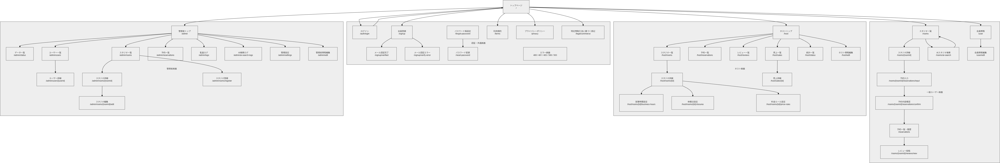
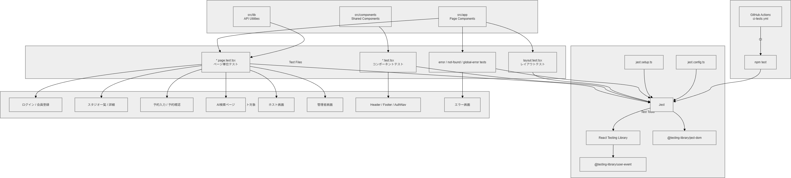

# Studio Book Frontend

**Studio Book Frontend** は、スタジオ時間貸し予約サービス **Studio Book** のフロントエンドアプリです。

Next.js App Router・React・TypeScript を使用し、一般ユーザー、スタジオ提供者（ホスト）、管理者向けの画面を実装しています。

---

## 概要

このフロントエンドは、ASP.NET Core Web API で構築したバックエンドと連携し、スタジオ検索、AI検索、予約、決済、レビュー投稿、ホスト管理、管理者管理などの画面を提供します。

主な役割は以下のとおりです。

- トップページ表示
- ログイン / 会員登録
- JWT Cookie 認証を前提としたログイン状態管理
- ロール別ナビゲーション表示
- スタジオ一覧 / 詳細表示
- AI自然文スタジオ検索
- 予約入力 / 予約内容確認
- Stripe Checkout への遷移
- 予約履歴表示
- レビュー投稿
- ホスト向けスタジオ・予約・売上・レビュー管理
- 管理者向けユーザー・スタジオ・予約・ログ・設定管理
- Jest / React Testing Library によるページ・コンポーネントテスト

---

## 技術スタック

| 技術 | 用途 |
|---|---|
| Next.js | フロントエンドフレームワーク |
| App Router | ルーティング |
| React | UI構築 |
| TypeScript | 型安全な実装 |
| Tailwind CSS | スタイリング |
| FullCalendar | 予約・休館日カレンダー |
| Recharts | 売上・統計グラフ |
| Stripe.js | Stripe Checkout連携 |
| Jest | テスト |
| React Testing Library | ページ / コンポーネントテスト |
| user-event | ユーザー操作テスト |
| Azure Static Web Apps | フロントエンドデプロイ |
| GitHub Actions | CI / デプロイ |

---

## ディレクトリ構成

```text
Frontend
├─ public
│  ├─ images
│  └─ storage
│
├─ src
│  ├─ app
│  │  ├─ admin
│  │  ├─ auth
│  │  ├─ error
│  │  ├─ forgot-password
│  │  ├─ host
│  │  ├─ legal
│  │  ├─ reservations
│  │  ├─ reset-password
│  │  ├─ rooms
│  │  ├─ signup
│  │  ├─ terms
│  │  ├─ user
│  │  ├─ layout.tsx
│  │  ├─ page.tsx
│  │  ├─ loading.tsx
│  │  ├─ not-found.tsx
│  │  └─ global-error.tsx
│  │
│  ├─ components
│  │  ├─ errors
│  │  └─ layout
│  │
│  └─ lib
│     └─ apiFetch.ts
│
├─ jest.config.ts
├─ jest.setup.ts
├─ next.config.ts
├─ package.json
├─ tsconfig.json
└─ README.md
```

---

## 画面構成

本フロントエンドは、一般ユーザー・ホスト・管理者の3ロールに分けて画面を構成しています。



本アプリでは、一般ユーザー・ホスト・管理者向けに **30画面以上** のページを実装しています。

### ロール別画面遷移

| 一般ユーザー | スタジオ提供者 | 管理者 |
|---|---|---|
|  |  |  |

### 共通・認証画面

| 画面 | パス |
|---|---|
| トップページ | `/` |
| ログイン | `/auth/login` |
| 会員登録 | `/signup` |
| メール認証完了 | `/signup/verified` |
| メール認証エラー | `/signup/verify-error` |
| パスワード再設定 | `/forgot-password` |
| パスワード変更 | `/reset-password` |
| 利用規約 | `/terms` |
| プライバシーポリシー | `/privacy` |
| 特定商取引法に基づく表記 | `/legal/commerce` |
| エラー画面 | `/error/*` |

### 一般ユーザー画面

| 画面 | パス |
|---|---|
| スタジオ一覧 | `/rooms` |
| スタジオ詳細 | `/rooms/[roomId]` |
| AIスタジオ検索 | `/rooms/ai-search` |
| 予約入力 | `/rooms/[roomId]/reservations/input` |
| 予約内容確認 | `/rooms/[roomId]/reservations/confirm` |
| 予約一覧 / 履歴 | `/reservations` |
| レビュー投稿 | `/rooms/[roomId]/reviews/new` |
| 会員情報 | `/user` |
| 会員情報編集 | `/user/edit` |

### ホスト画面

| 画面 | パス |
|---|---|
| ホストトップ | `/host` |
| ホスト情報編集 | `/host/edit` |
| スタジオ一覧 | `/host/rooms` |
| スタジオ詳細 | `/host/rooms/[id]` |
| 営業時間設定 | `/host/rooms/[id]/business-hours` |
| 休館日設定 | `/host/rooms/[id]/closures` |
| 料金ルール設定 | `/host/rooms/[id]/price-rules` |
| 予約一覧 | `/host/reservations` |
| レビュー一覧 | `/host/reviews` |
| 売上一覧 | `/host/sales` |
| 売上詳細 | `/host/sales/[id]` |
| 統計一覧 | `/host/status` |

### 管理者画面

| 画面 | パス |
|---|---|
| 管理者トップ | `/admin` |
| 管理者情報編集 | `/admin/edit` |
| データ一覧 | `/admin/status` |
| ユーザー一覧 | `/admin/users` |
| ユーザー詳細 | `/admin/users/[userId]` |
| スタジオ一覧 | `/admin/rooms` |
| スタジオ詳細 | `/admin/rooms/[roomId]` |
| スタジオ登録 | `/admin/rooms/register` |
| スタジオ編集 | `/admin/rooms/[roomId]/edit` |
| 予約一覧 | `/admin/reservations` |
| 監査ログ | `/admin/logs` |
| AI検索ログ | `/admin/ai-search-logs` |
| 管理設定 | `/admin/settings` |

---

## ルーティング構成

Next.js App Router を使用し、`src/app` 配下で画面単位のルーティングを定義しています。

| 区分 | 方針 |
|---|---|
| `src/app` | ページ単位のルーティング |
| `src/components` | Header / Footer / ErrorPageTemplate などの共通部品 |
| `src/lib` | API通信などの共通処理 |
| 動的ルート | `[roomId]`、`[id]`、`[userId]` などを使用 |
| エラー画面 | 400 / 401 / 403 / 500 / 503 を個別ページとして定義 |

---

## API通信

バックエンドAPIとの通信は、`src/lib/apiFetch.ts` を中心に共通化しています。

- `NEXT_PUBLIC_API_BASE_URL` を使用してAPIベースURLを切り替える
- Cookie認証を前提に `credentials: "include"` を付与
- APIエラー時は共通的にエラーハンドリングする
- ページ側では、必要なデータ取得・表示・エラー表示に集中する

---

## 環境変数

`Frontend/.env.local` を作成します。

```env
NEXT_PUBLIC_API_BASE_URL=https://localhost:7226
```

本番環境では Azure Static Web Apps 側の環境変数として設定します。

---

## 認証・ロール別表示

本アプリでは、バックエンドが発行した JWT を HttpOnly Cookie に保存します。フロントエンド側では `/api/auth/me` を呼び出し、ログイン状態とロールを判定します。

### 主なロール

| ロール | 説明 |
|---|---|
| `GeneralUser` | 一般ユーザー |
| `Host` | スタジオ提供者 |
| `Admin` | 管理者 |

### 画面制御

| 区分 | 制御内容 |
|---|---|
| 未ログイン | トップ、スタジオ一覧、詳細、ログイン、会員登録などを表示 |
| 一般ユーザー | 予約、予約履歴、レビュー投稿、会員情報を表示 |
| ホスト | ホスト管理メニューを表示 |
| 管理者 | 管理者メニューを表示 |
| 権限不足 | 403画面へ誘導 |

---

## 予約・決済画面フロー

予約・決済は、スタジオ詳細画面から予約入力、予約確認、Stripe Checkout へ進む流れです。


```
スタジオ詳細
    ↓
予約入力
    ↓
予約内容確認
    ↓
Stripe Checkout
    ↓
予約一覧 / 履歴
```

### 予約入力画面

予約入力画面では、利用日時や利用時間を入力します。主な処理は以下のとおりです。

- 予約日時の入力
- 利用時間の入力
- バリデーション
- 予約確認APIの呼び出し

### 予約内容確認画面

予約内容確認画面では、バックエンドで計算された料金内訳を表示します。主な表示内容は以下のとおりです。

- スタジオ名
- 利用日時
- 利用時間
- 基本料金
- 税
- プラットフォーム手数料
- 合計金額

---

## AIスタジオ検索

AIスタジオ検索では、ユーザーが自然文で希望条件を入力できます。

**入力例:**

> 落ち着いた雰囲気で、夜に使える撮影向けのスタジオを探したい

フロントエンドでは、入力文をバックエンドAPIへ送信し、AIが解釈した条件と検索結果を表示します。

主な表示内容は以下のとおりです。

- 入力した自然文
- AIが解釈した条件
- 条件に近いスタジオ一覧
- 検索エラー時のメッセージ

---

## ホスト画面

ホスト画面では、自分が所有するスタジオに関する管理機能を提供します。

### 主な機能

- 自分のスタジオ一覧表示
- スタジオ詳細表示
- 営業時間設定
- 休館日設定
- 料金ルール設定
- 予約一覧表示
- レビュー一覧表示
- 売上一覧表示
- 売上詳細表示
- CSV出力
- PDF出力
- 統計表示

### 利用ライブラリ

| ライブラリ | 用途 |
|---|---|
| FullCalendar | 営業時間・休館日・予約状況の表示 |
| Recharts | 売上・統計グラフ |
| Stripe.js | 決済関連の画面連携 |

---

## 管理者画面

管理者画面では、アプリ全体を確認・管理できます。

### 主な機能

- ユーザー一覧 / 詳細
- スタジオ一覧 / 詳細 / 登録 / 編集
- 予約一覧
- システム設定
- 監査ログ一覧
- AI検索ログ一覧
- 管理者向け統計表示

### 管理者画面で確認できる情報

- 登録スタジオ数
- ホスト数
- 予約件数
- 手数料売上
- AI検索の利用状況
- 管理操作ログ

---

## エラー画面

本フロントエンドでは、以下のエラー画面を用意しています。

| ページ | 用途 |
|---|---|
| `/error/400` | 不正なリクエスト |
| `/error/401` | 未認証 |
| `/error/403` | 権限不足 |
| `/error/500` | サーバーエラー |
| `/error/503` | サービス利用不可 |
| `not-found.tsx` | 404 Not Found |
| `global-error.tsx` | 予期しないエラー |

エラーページは `ErrorPageTemplate` を使用し、表示形式を共通化しています。

---

## 共通コンポーネント

| Component | 概要 |
|---|---|
| `Header` | 共通ヘッダー |
| `Footer` | 共通フッター |
| `AuthNav` | ログイン状態・ロール別ナビゲーション |
| `ErrorPageTemplate` | エラーページ共通テンプレート |

---

## テスト構成

Jest / React Testing Library を使用し、ページ・コンポーネント単位のテストを実装しています。



### テスト実行

```bash
cd Frontend
npm test
```

### 主なテスト対象

**ページテスト**

- トップページ
- ログインページ
- 会員登録ページ
- パスワード再設定ページ
- スタジオ一覧ページ
- スタジオ詳細ページ
- AI検索ページ
- 予約入力ページ
- 予約確認ページ
- 予約一覧ページ
- レビュー投稿ページ
- ホスト画面
- 管理者画面
- エラー画面

**コンポーネントテスト**

- Header
- Footer
- AuthNav
- ErrorPageTemplate

### テスト方針

| 区分 | 方針 |
|---|---|
| Page Test | 画面表示、API結果反映、入力操作、エラー表示を確認 |
| Component Test | 表示切替、ロール別ナビゲーション、クリック操作を確認 |
| Error Test | エラー画面、404、global-error の表示を確認 |
| Mock | fetch、window.location、外部UI依存を必要に応じてモック |

---

## CI

GitHub Actions により、push / pull request 時にフロントエンドのテストを実行します。

**主なワークフロー:**

- `.github/workflows/ci-tests.yml`
- `.github/workflows/azure-static-web-apps-*.yml`

**主な実行内容:**

```
npm install
    ↓
npm test
    ↓
Azure Static Web Apps Deploy
```

---

## デプロイ

Frontend は Azure Static Web Apps へのデプロイを想定しています。

```
GitHub Repository
        ↓
GitHub Actions
        ↓
Azure Static Web Apps
        ↓
Next.js Frontend
```

バックエンドAPIは Heroku 上の ASP.NET Core Web API を参照します。

---

## ローカル開発環境

### 前提

- Node.js
- npm
- Git
- Backend API 起動済み

### 起動手順

```bash
cd Frontend
npm install
npm run dev
```

フロントエンドは以下で起動します。

```
http://localhost:3000
```

Turbopack で不安定な場合は、Webpack で起動します。

```bash
npm run dev -- --webpack
```

### 主な npm scripts

| Script | 概要 |
|---|---|
| `npm run dev` | 開発サーバー起動 |
| `npm run build` | 本番ビルド |
| `npm start` | 本番起動 |
| `npm test` | Jestテスト実行 |
| `npm run lint` | Lint実行 |

### 環境変数

`Frontend/.env.local` を作成し、API URLを設定します。

```env
NEXT_PUBLIC_API_BASE_URL=https://localhost:7226
```

本番環境では、Azure Static Web Apps の環境変数として設定します。

---

## 関連設計資料

| 資料 | パス |
|---|---|
| アーキテクチャ資料 | `../docs/ARCHITECTURE.md` |
| 画面構成図 | `../docs/diagrams/frontend-page-structure.drawio.png` |
| ルーティング構成図 | `../docs/diagrams/frontend-routing-structure.drawio.png` |
| フロントエンドテスト構成図 | `../docs/diagrams/frontend-test-structure.drawio.png` |
| 予約・決済フロー図 | `../docs/diagrams/booking-payment-flow.drawio.png` |
| システム構成図 | `../docs/diagrams/system-architecture.drawio.png` |

---

## 注意事項

- このフロントエンドは個人ポートフォリオ用途を想定した学習・実装用アプリです。
- 実在する個人情報、住所、電話番号、メールアドレスは登録しない前提です。
- Stripe決済はテストモードを前提としています。実料金は発生しません。
- AI機能は補助機能であり、AIによる条件解釈や文章生成には不正確な内容が含まれる可能性があります。
- API URL や公開環境のURLは、環境ごとに切り替える前提です。
- 実運用には、セキュリティ、個人情報保護、監査ログ、運用監視、アクセシビリティなどの追加検討が必要です。

---

## 関連リンク

- [Root README](../README.md)
- [Backend README](../Backend/README.md)
- [Architecture](../docs/ARCHITECTURE.md)