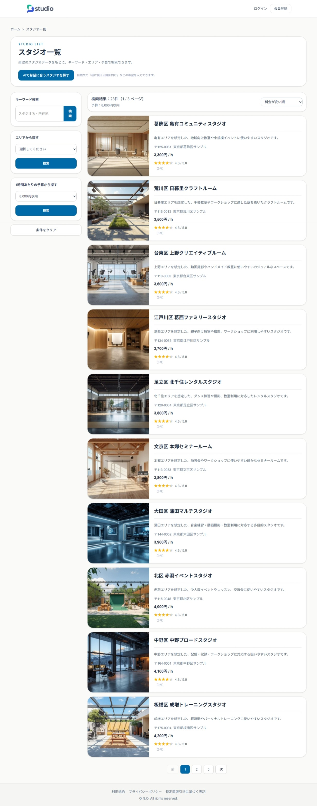
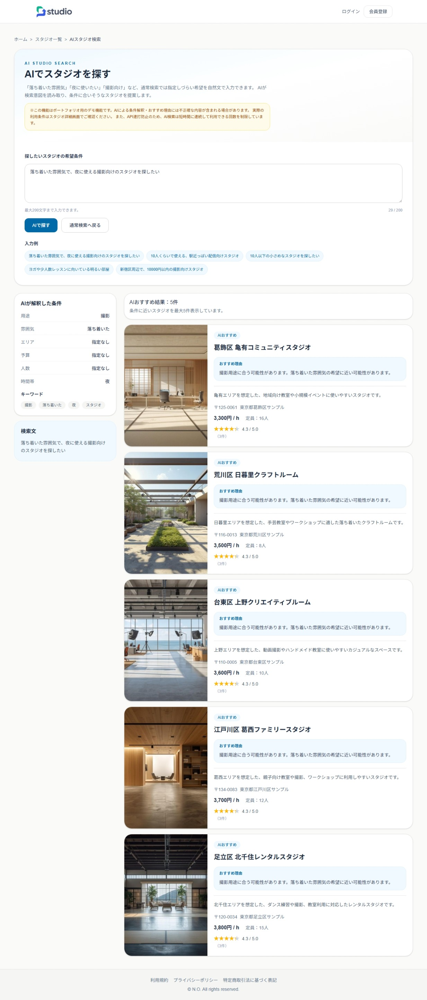
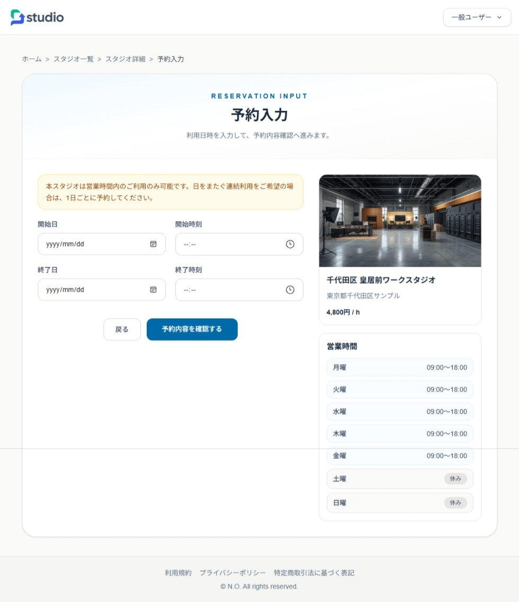
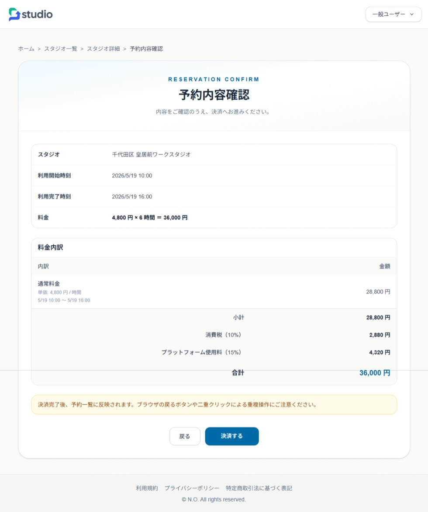
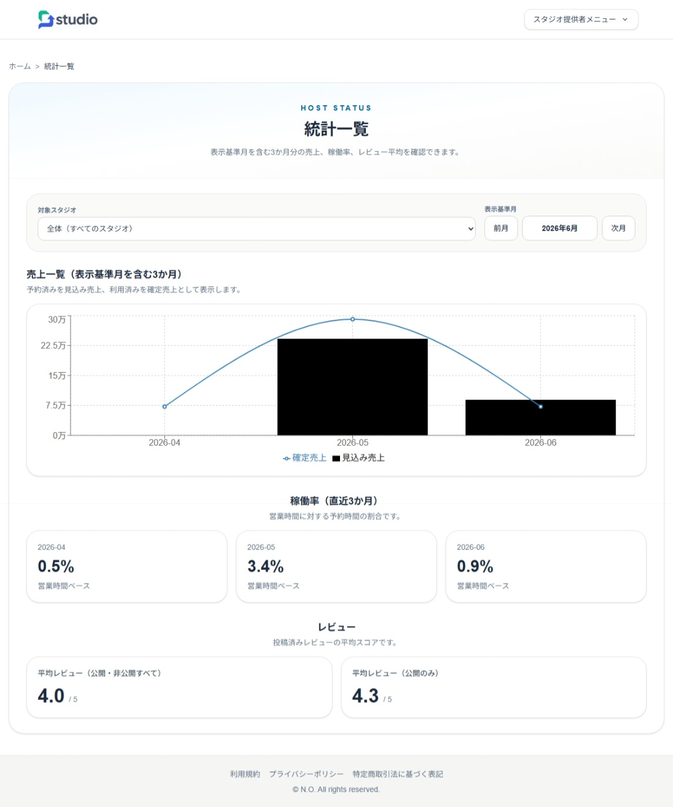
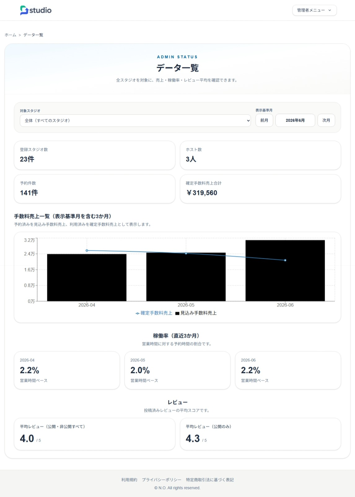

# Studio Book .NET + Next.js

[](https://github.com/fewioaghwrao/studio-book-dotnet-next/actions/workflows/ci-tests.yml)
[](https://github.com/fewioaghwrao/studio-book-dotnet-next/actions/workflows/azure-static-web-apps-gray-bush-08e107700.yml)

Studio Book は、**ASP.NET Core Web API + Next.js** で構築した、スタジオ時間貸し予約サービスのフルスタックポートフォリオアプリです。

一般ユーザーはスタジオ検索、AI検索、予約、Stripe決済、レビュー投稿を行えます。  
スタジオ提供者（ホスト）は、スタジオ情報、営業時間、休館日、料金ルール、予約、売上、レビューを管理できます。  
管理者は、ユーザー、スタジオ、予約、システム設定、監査ログ、AI検索ログを管理できます。

既存の Java / Spring Boot 版 Studio Book を参考にしつつ、  
**ASP.NET Core Web API + Next.js App Router** 構成として再設計・再実装したアプリです。

---

## デモサイト

| 対象 | URL |
|---|---|
| フロントエンド | https://gray-bush-08e107700.7.azurestaticapps.net |
| バックエンドAPI | https://studio-book-api-60c4e5850000.herokuapp.com |
| ヘルスチェック | https://studio-book-api-60c4e5850000.herokuapp.com/health |
| Swagger UI | https://studio-book-api-60c4e5850000.herokuapp.com/swagger |

### デモアカウント

| ロール | メールアドレス | パスワード |
|---|---|---|
| 管理者 | admin@example.com | Admin1234! |
| ホスト | host@example.com | Host1234! |
| 一般ユーザー | user@example.com | User1234! |

### バックエンドAPI確認

**ヘルスチェック**

```
GET https://studio-book-api-60c4e5850000.herokuapp.com/health
```

APIサーバーの起動状態を確認できます。Heroku のスリープにより、初回アクセス時にレスポンスが遅延することがあります。

**Swagger UI**

```
https://studio-book-api-60c4e5850000.herokuapp.com/swagger
```

全APIエンドポイントの仕様確認・動作テストが可能です。認証が必要なエンドポイントでは、ログインAPIでJWTアクセストークンを取得します。
Swagger UIからBearerトークンを設定する場合は、Swaggerの認証設定が必要です。

---

## このアプリで示したいこと

- ASP.NET Core Web API と Next.js によるフロントエンド / バックエンド分離構成
- 一般ユーザー / ホスト / 管理者の3ロール設計
- JWT Bearer 認証とロール別アクセス制御
- スタジオ検索、予約、決済、レビュー投稿までの一連の業務フロー
- 営業時間、休館日、料金ルールを考慮した予約管理
- Stripe Checkout / Webhook を想定した決済連携
- OpenAI API を利用した自然文スタジオ検索・レビュー補助
- 管理者向けの監査ログ、AI検索ログ、システム設定管理
- Entity Framework Core Migration によるDBスキーマ管理
- xUnit / Jest によるバックエンド・フロントエンドテスト
- GitHub Actions によるCI
- Azure Static Web Apps + Heroku を想定した分離デプロイ構成

---

## アプリ概要

Studio Book は、ダンススタジオ・撮影スタジオ・レンタルスペースなどの時間貸し予約を想定したWebアプリです。

### 主な利用者

| ロール | 主な操作 |
|---|---|
| 一般ユーザー | スタジオ検索、AI検索、予約、決済、予約履歴、レビュー投稿 |
| ホスト | スタジオ管理、営業時間設定、休館日設定、料金ルール設定、予約管理、売上管理、レビュー管理 |
| 管理者 | ユーザー管理、スタジオ管理、予約管理、設定管理、監査ログ確認、AI検索ログ確認 |

---

## 画面イメージ

本アプリでは、一般ユーザー・ホスト・管理者向けに **30画面以上** のページを実装しています。以下は主要画面の抜粋です。

### トップページ

スタジオ検索、人気スタジオ、新着スタジオへの導線を持つトップページです。


### 認証画面

ログイン、会員登録、メール認証、パスワード再設定に対応しています。

| ログイン | 会員登録 |
|---|---|
|  |  |

### 一般ユーザー向け画面

スタジオ一覧、詳細確認、AI検索、予約入力、予約内容確認までの導線を実装しています。

| スタジオ一覧 | スタジオ詳細 |
|---|---|
|  |  |

| AIスタジオ検索 | 予約入力 |
|---|---|
|  |  |

| 予約内容確認 |
|---|
|  |

### ホスト・管理者向け画面

ホストは売上・稼働率・レビュー平均などを確認できます。  
管理者は全体の登録スタジオ数、ホスト数、予約件数、手数料売上などを確認できます。

| ホスト統計 | 管理者データ一覧 |
|---|---|
|  |  |

---

## 画面規模

### 共通・認証

- トップページ
- ログイン
- 会員登録
- メール認証完了
- メール認証エラー
- パスワード再設定
- パスワード変更
- 利用規約
- プライバシーポリシー
- 特定商取引法に基づく表記
- エラーページ

### 一般ユーザー

- スタジオ一覧
- スタジオ詳細
- AIスタジオ検索
- 予約入力
- 予約内容確認
- Stripe決済
- 予約一覧 / 履歴
- レビュー投稿
- 会員情報
- 会員情報編集

### ホスト

- ホスト用トップページ
- ホスト情報編集
- スタジオ一覧
- スタジオ詳細
- 営業時間設定
- 休館日設定
- 料金ルール設定
- 予約一覧
- レビュー一覧
- 売上一覧
- 売上詳細
- 統計一覧

### 管理者

- 管理者トップページ
- 管理者情報編集
- データ一覧
- ユーザー一覧
- ユーザー詳細
- スタジオ一覧
- スタジオ詳細
- スタジオ登録
- スタジオ編集
- 予約一覧
- ログ一覧
- AI検索ログ一覧
- 管理設定

---

## 主な機能

### 共通機能

- 会員登録
- メール認証
- ログイン / ログアウト
- JWT Bearer 認証
- パスワードリセット
- 会員情報編集
- ロール別メニュー表示
- エラー画面
- レスポンシブ対応

### 一般ユーザー機能

- スタジオ一覧表示
- スタジオ検索
- AI自然文スタジオ検索
- スタジオ詳細表示
- 営業時間・料金ルール・レビュー確認
- カレンダーによる空き状況確認
- 予約入力
- 予約内容確認
- Stripe Checkout による決済
- 予約履歴確認
- レビュー投稿
- AIレビュー文補助

### ホスト機能

- ホスト用マイページ
- 自分のスタジオ一覧
- スタジオ詳細確認
- 営業時間管理
- 休館日管理
- 料金ルール管理
- 予約一覧・予約状態管理
- レビュー一覧
- レビュー返信
- 売上一覧
- 売上詳細
- 売上CSV出力
- 売上明細・請求書PDF出力
- 統計表示

料金ルールは時間帯別の倍率設定と固定費設定を管理できます。
現在の予約料金計算では、時間帯別の倍率ルールを適用しています。
固定費ルールの料金計算への反映は今後の改善対象です。

### 管理者機能

- 管理者用マイページ
- ユーザー一覧 / 詳細
- スタジオ一覧 / 詳細 / 登録 / 編集
- 予約一覧
- システム設定管理
- ステータス確認
- 監査ログ一覧
- AI検索ログ一覧

---

## AI機能

### AI自然文スタジオ検索

ユーザーが自然文で希望条件を入力すると、OpenAI API を用いて検索条件へ変換し、条件に近いスタジオを表示します。

**入力例:**

```
落ち着いた雰囲気で、夜に使える撮影向けのスタジオを探したい
```

AIが以下のような条件を解釈します。

- 用途
- 雰囲気
- エリア
- 予算
- 人数
- 時間帯
- キーワード

AI検索APIには連打対策として `RateLimiter` を設定し、検索ログを `AiSearchLogs` に保存します。IPアドレス単位で1分間に5回まで利用できます。
上限を超えた場合はHTTP 429を返し、拒否された検索もAI検索ログへ記録します。

### AIレビュー文補助

レビュー投稿画面で、ユーザーが入力した感想文をAIが自然なレビュー文に整えます。

AIが生成した文章はそのまま投稿されるのではなく、ユーザーが確認・修正してから投稿する設計です。

---

## 技術スタック

### Backend

| 技術 | 用途 |
|---|---|
| ASP.NET Core 8 Web API | APIサーバー |
| C# | バックエンド実装 |
| Entity Framework Core | ORM / DBアクセス |
| MySQL | データベース |
| JWT Bearer Authentication | JWTの発行・検証・認証 |
| ASP.NET Core Authorization | ロール別認可 |
| ASP.NET Core RateLimiter | AI検索などのレート制限 |
| Stripe API | 決済連携 |
| QuestPDF | PDF生成 |
| OpenAI API | AI検索・レビュー補助 |
| xUnit | バックエンドテスト |
| Moq | モック作成 |
| EF Core InMemory | サービステスト用DB |

### Frontend

| 技術 | 用途 |
|---|---|
| Next.js | フロントエンド |
| React | UI構築 |
| TypeScript | 型安全な実装 |
| Tailwind CSS | スタイリング |
| FullCalendar | カレンダーUI |
| Recharts | グラフ・統計表示 |
| Stripe.js | 決済UI連携 |
| Jest | フロントエンドテスト |
| React Testing Library | コンポーネント / ページテスト |

### Infrastructure / DevOps

| 技術 | 用途 |
|---|---|
| GitHub Actions | CI |
| Azure Static Web Apps | フロントエンドデプロイ |
| Heroku | バックエンドデプロイ |
| JawsDB MySQL | Heroku上のMySQL |
| Docker Compose | ローカルのASP.NET Core API・MySQL実行環境 |
| Swagger | API確認 |
| Mailtrap | メール送信確認 |

---

## アーキテクチャ概要

```
[Browser]
   |
   v
[Next.js Frontend]
   |
   | HTTP / JSON
   v
[ASP.NET Core Web API]
   |
   v
[Service Layer]
   |
   v
[Entity Framework Core]
   |
   v
[MySQL]
```

**外部サービス連携:**

```
[ASP.NET Core Web API]
   ├─ Stripe Checkout / Webhook
   ├─ OpenAI API
   └─ Mailtrap
```

### ローカルDocker構成

```text
[Next.js Frontend]
Windows上で npm run dev
        |
        | http://localhost:5000
        v
[studio-book-api]
ASP.NET Core API / Docker
        |
        | Server=mysql;Port=3306
        v
[studio-book-mysql]
MySQL 8.4 / Docker
```

### レイヤー構成

```
Controller
  ↓
Service
  ↓
DbContext / Entity
  ↓
MySQL
```

### 責務分離

| 層 | 主な責務 |
|---|---|
| Controller | APIエンドポイント、認証・認可、HTTPレスポンス変換 |
| Service | 業務ロジック、予約処理、料金計算、売上集計、AI連携、ログ記録 |
| Entity | DB永続化モデル |
| DTO | API入出力モデル |
| DbContext | EF Core によるDB操作 |
| Frontend Page | 画面単位のUI・状態管理 |
| Components | 共通UI部品 |
| lib/apiFetch | API通信の共通化 |

---

## ディレクトリ構成

```text
studio-book-dotnet-next
├─ .dockerignore
├─ docker-compose.yml
│
├─ .github
│  └─ workflows
│     ├─ azure-static-web-apps-*.yml
│     └─ ci-tests.yml
│
├─ docs
│  ├─ ARCHITECTURE.md
│  ├─ design
│  │  ├─ requirements-definition.md
│  │  ├─ basic-design.md
│  │  └─ detail-design.md
│  ├─ diagrams
│  └─ images
│
├─ Backend
│  ├─ README.md
│  ├─ Studiobook_backend.sln
│  ├─ Studiobook_backend
│  │  ├─ Controllers
│  │  ├─ Data
│  │  ├─ Dtos
│  │  ├─ Entities
│  │  ├─ Migrations
│  │  ├─ Seeders
│  │  ├─ Services
│  │  ├─ Settings
│  │  ├─ Fonts
│  │  ├─ Dockerfile
│  │  ├─ Program.cs
│  │  ├─ appsettings.json
│  │  └─ Procfile
│  │
│  └─ Studiobook_backend.Tests
│     ├─ Controllers
│     ├─ Services
│     └─ Helpers
│
└─ Frontend
   ├─ README.md
   ├─ package.json
   ├─ next.config.ts
   ├─ jest.config.ts
   ├─ public
   │  ├─ images
   │  └─ storage
   └─ src
      ├─ app
      ├─ components
      └─ lib
```


---

## 代表的なAPI

### 認証

| Method | Endpoint | 概要 |
|---|---|---|
| POST | /api/auth/signup | 会員登録・認証メール送信 |
| GET | /api/auth/verify | メールアドレス認証 |
| POST | /api/auth/login | ログイン・JWT発行 |
| POST | /api/auth/logout | ログアウト |
| GET | /api/auth/me | ログイン中ユーザー取得 |
| PUT | /api/auth/me | ログイン中ユーザー情報更新 |
| POST | /api/auth/forgot-password | パスワード再設定メール送信 |
| POST | /api/auth/reset-password | パスワード再設定 |

### 一般ユーザー

| Method | Endpoint | 概要 |
|---|---|---|
| GET | /api/home | トップページ用データ取得 |
| GET | /api/rooms | スタジオ一覧 |
| GET | /api/rooms/{roomId} | スタジオ詳細 |
| POST | /api/reservations/confirm | 予約内容確認 |
| POST | /api/reservations/confirm | 予約条件・料金確認、Stripe Checkout セッション作成 |
| GET | /api/reservations | 自分の予約一覧 |
| GET | /api/rooms/{roomId}/reviews/new | レビュー投稿画面用データ取得 |
| POST | /api/rooms/{roomId}/reviews | レビュー投稿 |

### AI

| Method | Endpoint | 概要 |
|---|---|---|
| POST | /api/ai/room-search | AI自然文スタジオ検索 |
| POST | /api/ai/review-assist | AIレビュー文補助 |

### ホスト

| Method | Endpoint | 概要 |
|---|---|---|
| GET | /api/host/rooms | 自分のスタジオ一覧 |
| GET | /api/host/rooms/{roomId} | スタジオ詳細 |
| GET / PUT | /api/host/rooms/{roomId}/business-hours | 営業時間取得 / 更新 |
| GET / POST | /api/host/rooms/{roomId}/closures | 休館日取得 / 登録 |
| DELETE | /api/host/rooms/{roomId}/closures/{closureId} | 休館日削除 |
| GET / POST | /api/host/rooms/{roomId}/price-rules | 料金ルール取得 / 登録 |
| GET | /api/host/reservations | 予約一覧 |
| GET | /api/host/sales | 売上一覧 |
| GET | /api/host/sales/{id} | 売上詳細 |
| GET | /api/host/sales.csv | 売上CSV出力 |
| GET | /api/host/status | 統計情報 |
| GET | /api/host/reviews | レビュー一覧 |
| GET | /api/host/rooms/{roomId}/closures/events | 休館日のカレンダーイベント取得 |
| DELETE | /api/host/rooms/{roomId}/price-rules/{ruleId} | 料金ルール削除 |
| POST | /api/host/reservations/{reservationId}/approve | 予約承認 |
| POST | /api/host/reservations/{reservationId}/cancel | 予約キャンセル |
| POST | /api/host/reviews/{reviewId}/reply | レビュー返信 |
| POST | /api/host/reviews/{reviewId}/visibility | レビュー公開状態変更 |
| GET | /api/host/sales/{reservationId}/items.csv | 売上明細CSV出力 |
| GET | /api/host/sales/{reservationId}/invoice.pdf | 売上明細PDF出力 |

### 管理者

| Method | Endpoint | 概要 |
|---|---|---|
| GET | /api/admin/users | ユーザー一覧 |
| GET | /api/admin/users/{id} | ユーザー詳細 |
| GET | /api/admin/rooms | スタジオ一覧 |
| GET | /api/admin/rooms/{id} | スタジオ詳細 |
| POST | /api/admin/rooms | スタジオ登録 |
| PUT | /api/admin/rooms/{id} | スタジオ更新 |
| GET | /api/admin/reservations | 予約一覧 |
| GET | /api/admin/settings | システム設定取得 |
| PUT | /api/admin/settings | システム設定更新 |
| GET | /api/admin/logs | 監査ログ一覧 |
| GET | /api/admin/ai-search-logs | AI検索ログ一覧 |
| GET | /api/admin/status | 管理者ダッシュボード |

---

## データベース設計

| テーブル | 概要 |
|---|---|
| Users | ユーザー情報 |
| Roles | ロール |
| UserRoles | ユーザーとロールの中間テーブル |
| Rooms | スタジオ情報 |
| BusinessHours | 営業時間 |
| Closures | 休館日 |
| PriceRules | 料金ルール |
| Reservations | 予約 |
| ReservationChargeItems | 予約料金明細 |
| Reviews | レビュー |
| VerificationTokens | メール認証トークン |
| PasswordResetTokens | パスワード再設定トークン |
| AppSettings | システム設定 |
| AuditLogs | 監査ログ |
| AiSearchLogs | AI検索ログ |

---

## ローカル開発環境

### 前提

- .NET 8 SDK
- Node.js / npm
- Docker Desktop
- Git
- Stripe CLI（Webhook確認時）
- OpenAI API Key（AI機能確認時）

### Backend・MySQL起動手順（Docker Compose）

リポジトリのルートディレクトリで、MySQLとASP.NET Core APIを起動します。

```bash
docker compose build
docker compose up -d
```

APIコンテナの起動時に、環境変数の設定に基づいて以下を実行します。

- `ENABLE_DB_MIGRATION=true`：EF Core Migrationを適用
- `ENABLE_DB_SEED=true`：デモデータを投入

そのため、通常のDocker起動では手動の
`dotnet ef database update` は不要です。

起動状態を確認します。

```bash
docker compose ps
```

正常時は、次の2コンテナが起動します。

```text
studio-book-mysql   healthy
studio-book-api     running
```

各URLは次のとおりです。

| 対象           | URL                           |
| ------------ | ----------------------------- |
| Backend API  | http://localhost:5000         |
| Health Check | http://localhost:5000/health  |
| Swagger UI   | http://localhost:5000/swagger |
| MySQL        | localhost:3306                |

APIログを確認する場合は、次を実行します。

```bash
docker compose logs -f api
```

停止する場合は、次を実行します。

```bash
docker compose down
```

MySQLのデータはDockerの名前付きボリュームに保存されるため、通常の `docker compose down` では削除されません。

データも含めて初期化する場合のみ、次を実行します。

```bash
docker compose down -v
```

### Backendをローカルで直接起動する場合

APIをDockerではなくローカルの.NET SDKから起動することもできます。

```bash
cd Backend/Studiobook_backend
dotnet restore
dotnet ef database update
dotnet run
```

この場合、MySQLコンテナのみ起動しておく必要があります。

```bash
docker compose up -d mysql
```

APIのURLは `Backend/Studiobook_backend/Properties/launchSettings.json` の設定に従います。


### Frontend 起動手順

```bash
cd Frontend
npm install
npm run dev
```

フロントエンドは以下で起動します。

```
http://localhost:3000
```

Turbopackで不安定な場合は、Webpackで起動します。

```bash
npm run dev -- --webpack
```

---

## 環境変数・シークレット管理

APIキーや接続情報は Git 管理しません。

### Backend

本物の値は User Secrets または環境変数で管理します。

```bash
dotnet user-secrets set "Jwt:SigningKey" "your-real-jwt-signing-key"
dotnet user-secrets set "OpenAI:ApiKey" "your-openai-api-key"
dotnet user-secrets set "Stripe:SecretKey" "your-stripe-secret-key"
dotnet user-secrets set "Stripe:WebhookSecret" "your-stripe-webhook-secret"
```

**主な設定項目:**

| Key | 用途 |
|---|---|
| ConnectionStrings:DefaultConnection | DB接続文字列 |
| Jwt:Issuer | JWT発行者 |
| Jwt:Audience | JWT利用者 |
| Jwt:SigningKey | JWT署名キー |
| Stripe:SecretKey | Stripe Secret Key |
| Stripe:PublishableKey | Stripe Publishable Key |
| Stripe:WebhookSecret | Stripe Webhook Secret |
| OpenAI:ApiKey | OpenAI API Key |
| Frontend:BaseUrl | フロントエンドURL |
| Mailtrap:Host | Mailtrapホスト |
| Mailtrap:Port | Mailtrapポート |
| Mailtrap:From | 送信元メールアドレス |
| Jwt:AccessTokenMinutes | JWTアクセストークン有効時間（分） |
| Cors:AllowedOrigins | 許可するフロントエンドOrigin |
| OpenAI:Model | 使用するOpenAIモデル |
| Mailtrap:UserName | SMTPユーザー名 |
| Mailtrap:Password | SMTPパスワード |
| ENABLE_SWAGGER | Swagger UIの有効化 |
| ENABLE_DB_MIGRATION | 起動時Migrationの実行 |
| ENABLE_DB_SEED | 起動時デモデータ投入 |

### Frontend

`Frontend/.env.local` を作成します。

Docker ComposeでバックエンドAPIを起動する場合:

```env
NEXT_PUBLIC_API_BASE_URL=http://localhost:5000
```

バックエンドを `dotnet run` で直接起動する場合は、`launchSettings.json` に記載されたURLを設定します。

```env
NEXT_PUBLIC_API_BASE_URL=https://localhost:7226
```

### Docker Compose

OpenAI APIキー、Stripeキー、本番用JWT署名キーなどは、
`docker-compose.yml` に直接記載せず、ルートの `.env` または
OSの環境変数から渡します。

`.env` はGit管理しません。

例:

```env
OPENAI_API_KEY=your-openai-api-key
STRIPE_SECRET_KEY=your-stripe-secret-key
STRIPE_WEBHOOK_SECRET=your-stripe-webhook-secret
```

---

## 認証・認可

ログインAPIで発行したJWTアクセストークンをBearerトークンとして使用し、
ASP.NET Core側で認証・ロール別認可を行います。

現在の正式な認証方式はBearer認証です。
バックエンドには互換用のCookie読取処理が一部残っていますが、
フロントエンドはAuthorizationヘッダーでJWTを送信します。

**主なロール:**

| ロール | 説明 |
|---|---|
| GeneralUser | 一般ユーザー |
| Host | スタジオ提供者 |
| Admin | 管理者 |

**権限制御:**

- 一般ユーザー系APIはログインユーザー本人のみ操作可能
- Host系APIは `Host` ロールが必要
- Host系APIでは、自分が所有するスタジオのみ操作可能
- Admin系APIは `Admin` ロールが必要
- 管理者操作は監査ログに記録

---

## 決済機能

Stripe Checkout を利用して、予約時の決済フローを実装しています。

**決済の流れ:**

```
予約入力
  ↓
予約内容確認
  ↓
Stripe Checkout セッション作成
  ↓
Stripe決済画面
  ↓
Webhook受信
  ↓
予約確定
  ↓
予約履歴に反映
```

決済完了処理は、画面遷移だけに依存せず、Stripe Webhook を前提として処理します。
また、Webhook受信後は、Stripe PaymentIntentのmetadataから予約情報を取得し、
バックエンド側で営業時間、休館日、既存予約、料金を再検証します。

Stripeの支払金額とバックエンドの再計算金額が一致した場合のみ、
予約と料金明細を登録します。

現在はスタジオ、ユーザー、予約日時、金額の組み合わせで
Webhook再送時の二重登録を抑止しています。

---

## ログ管理

### 監査ログ

管理操作や重要なイベントを `AuditLogs` に記録します。

**記録対象の例:**

- ログイン
- 管理者操作
- 予約操作
- 設定変更

### AI検索ログ

AI自然文検索の利用状況を `AiSearchLogs` に記録します。

**記録内容:**

- 検索文
- IPアドレス
- ユーザーID
- 使用モデル
- 成功 / 失敗
- 結果件数
- エラー内容

---

## テスト

### Backend

xUnit を使用し、Controller / Service 単位のテストを実装しています。

```bash
cd Backend
dotnet test
```

**主なテスト対象:**

- AuthController
- HomeController
- RoomsController
- ReservationsController
- ReviewsController
- StripeWebhookController
- AiRoomSearchController
- AiReviewAssistController
- Host系Controller
- Admin系Controller
- AuthService
- ReservationConfirmService / ReservationCompleteService
- RoomSearchService / RoomDetailService
- Host系Service
- Admin系Service
- AiRoomSearchService / AiReviewAssistService / AiSearchLogService
- OpenAiRoomSearchClient / OpenAiReviewAssistClient
- StripeCheckoutService

### Frontend

Jest / React Testing Library を使用し、ページ・コンポーネント単位のテストを実装しています。

```bash
cd Frontend
npm test
```

**主なテスト対象:**

- トップページ
- ログインページ
- 会員登録ページ
- スタジオ一覧 / 詳細
- 予約入力 / 確認
- AI検索ページ
- ホスト画面
- 管理者画面
- エラーページ
- Header / Footer / AuthNav

---

## CI

GitHub Actions により、push / pull request 時にテストを実行します。

**主なワークフロー:**

- `.github/workflows/ci-tests.yml`
- `.github/workflows/azure-static-web-apps-*.yml`

**実行内容の例:**

- .NET restore
- .NET build
- .NET test
- Frontend install
- Frontend test
- Azure Static Web Apps deploy

---

## デプロイ構成

本アプリは、フロントエンドとバックエンドを分離してデプロイする構成です。

```
[Azure Static Web Apps]
        |
        v
[Heroku ASP.NET Core API]
        |
        v
[JawsDB MySQL]
```

| 対象 | デプロイ先 |
|---|---|
| Frontend | Azure Static Web Apps |
| Backend | Heroku |
| Database | JawsDB MySQL |

---

## 今後の改善予定

- [ ] Stripe Webhook の冪等制御強化
- [ ] OpenAI API利用量の可視化
- [ ] 管理者向けログ検索機能の拡張
- [ ] E2Eテストの追加
- [ ] 本番想定の監視・ログ出力強化
- [ ] UIのレスポンシブ調整
- [ ] デモ環境の安定化
- [ ] 予約状態（booked / paid / canceled）の業務上の意味と遷移整理
- [ ] JWT認証処理をBearer方式へ完全統一
- [ ] ログインユーザーID取得処理の共通化
- [ ] 固定費料金ルールの予約料金計算への反映
- [ ] 予約状態と状態遷移の整理
- [ ] Stripe PaymentIntent IDによるWebhook冪等制御
- [ ] UTC / JSTの日時処理方針統一
- [ ] APIエラーレスポンス形式の統一
- [ ] レビューのユーザー・スタジオ複合一意制約追加
- [ ] 予約重複登録に対する同時実行制御

---

## 注意事項

- このアプリは個人ポートフォリオ用途を想定した学習・実装用アプリです。
- 実在する個人情報、住所、電話番号、メールアドレスは登録しない前提です。
- 掲載しているスタジオ名、住所、レビュー等は架空のデモデータです。
- 画像にはAI生成画像またはサンプル画像を使用しています。
- Stripe決済はテストモードを前提としています。実料金は発生しません。
- AI機能は補助機能であり、AIによる条件解釈や文章生成には不正確な内容が含まれる可能性があります。
- 実運用には、セキュリティ、決済、個人情報保護、監査ログ、運用監視などの追加検討が必要です。

---

## 関連ドキュメント

## 関連ドキュメント

| ドキュメント | パス |
|---|---|
| 要件定義書 | [docs/design/requirements-definition.md](docs/design/requirements-definition.md) |
| 基本設計書 | [docs/design/basic-design.md](docs/design/basic-design.md) |
| 詳細設計書 | [docs/design/detail-design.md](docs/design/detail-design.md) |
| アーキテクチャ資料 | [docs/ARCHITECTURE.md](docs/ARCHITECTURE.md) |
| Backend README | [Backend/README.md](Backend/README.md) |
| Frontend README | [Frontend/README.md](Frontend/README.md) |

---

## ライセンス

このリポジトリは個人ポートフォリオ用途を想定しています。  
再利用・公開範囲については、必要に応じてライセンスを追加してください。