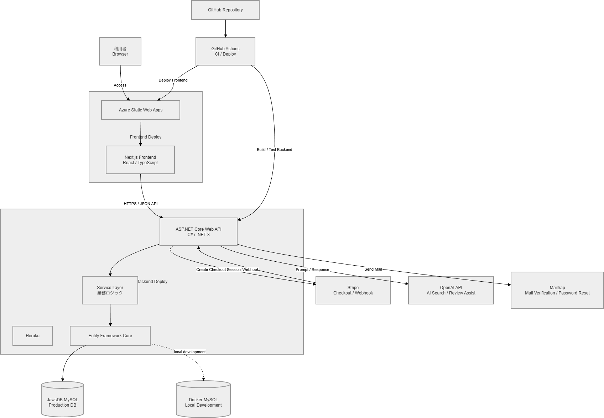
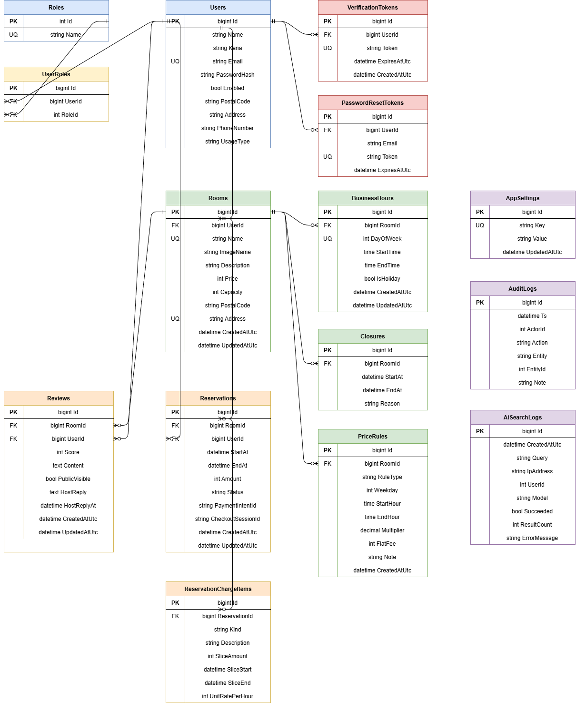
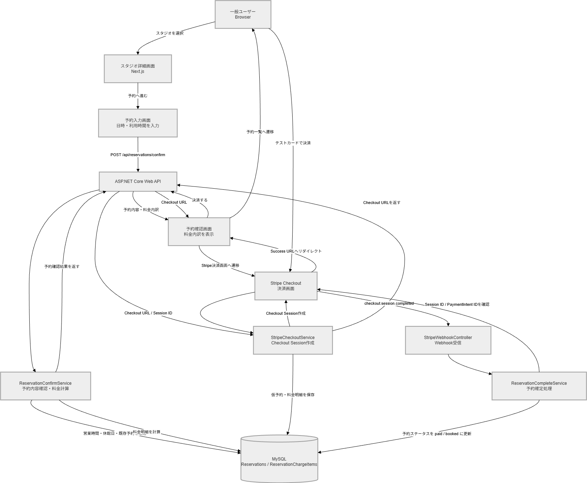
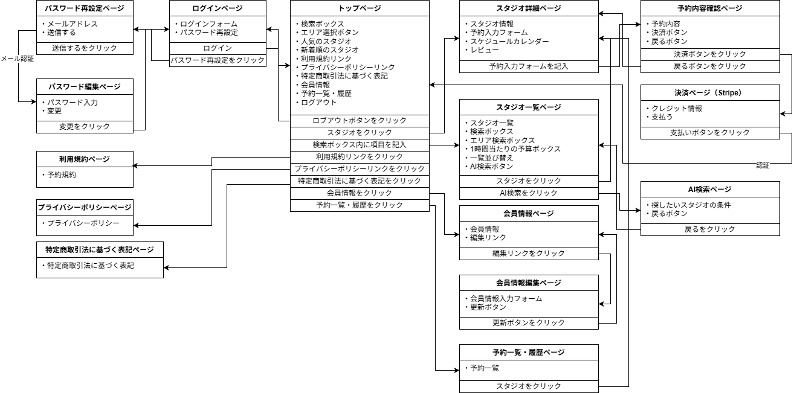
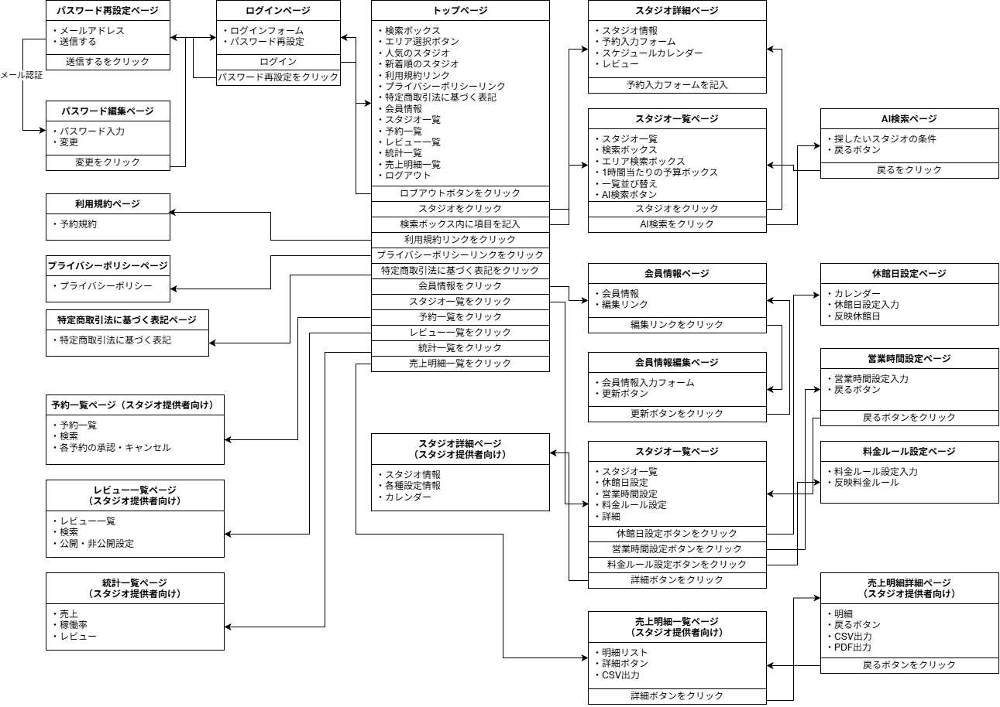
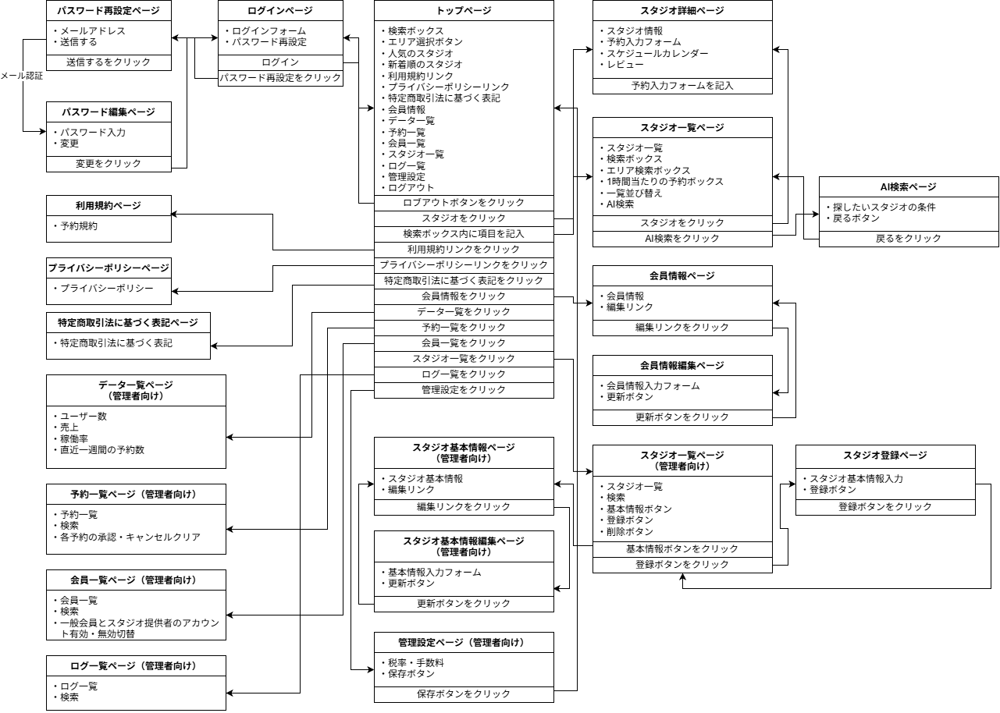
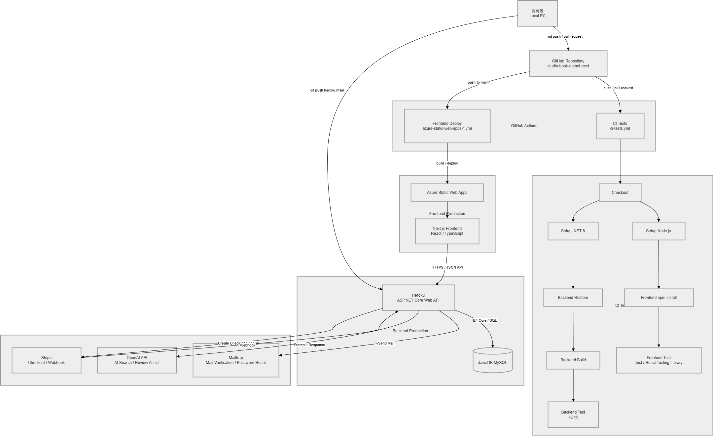

# Architecture - Studio Book .NET + Next.js

Studio Book .NET + Next.js のアーキテクチャ資料です。

本アプリは、**Next.js フロントエンド** と **ASP.NET Core Web API バックエンド** を分離した構成で実装しています。  
一般ユーザー、スタジオ提供者、管理者の3ロールを対象に、スタジオ検索、予約、決済、レビュー、売上管理、監査ログ、AI検索などを扱います。

---

## 目次

- [全体構成](#全体構成)
- [システム構成図](#システム構成図)
- [アプリケーション構成](#アプリケーション構成)
- [バックエンド構成](#バックエンド構成)
- [フロントエンド構成](#フロントエンド構成)
- [データベース設計](#データベース設計)
- [予約・決済フロー](#予約決済フロー)
- [ロール別画面遷移](#ロール別画面遷移)
- [認証・認可](#認証認可)
- [AI機能](#ai機能)
- [ログ設計](#ログ設計)
- [CI/CD・デプロイ構成](#cicdデプロイ構成)
- [設計上のポイント](#設計上のポイント)

---

## 全体構成

Studio Book は、以下のような分離構成です。

```
[Browser]
   |
   v
[Next.js Frontend]
   |
   | HTTPS / JSON API
   v
[ASP.NET Core Web API]
   |
   v
[Service Layer]
   |
   v
[Entity Framework Core]
   |
   v
[MySQL]
```

外部サービスとして、Stripe、OpenAI API、Mailtrap を利用します。

```
[ASP.NET Core Web API]
   ├─ Stripe Checkout / Webhook
   ├─ OpenAI API
   └─ Mailtrap
```

---

## システム構成図

フロントエンドは Azure Static Web Apps、バックエンドは Heroku、DB は JawsDB MySQL を想定した構成です。



| 項目 | 内容 |
|---|---|
| Frontend | Next.js / React / TypeScript |
| Frontend Hosting | Azure Static Web Apps |
| Backend | ASP.NET Core Web API / C# / .NET 8 |
| Backend Hosting | Heroku |
| Database | JawsDB MySQL |
| ORM | Entity Framework Core |
| Payment | Stripe Checkout / Webhook |
| AI | OpenAI API |
| Mail | Mailtrap |
| CI/CD | GitHub Actions |

---

## アプリケーション構成

本アプリは、フロントエンドとバックエンドを明確に分離しています。

```
studio-book-dotnet-next
├─ Backend
│  ├─ Studiobook_backend
│  │  ├─ Controllers
│  │  ├─ Data
│  │  ├─ Dtos
│  │  ├─ Entities
│  │  ├─ Migrations
│  │  ├─ Seeders
│  │  ├─ Services
│  │  ├─ Settings
│  │  └─ Program.cs
│  │
│  └─ Studiobook_backend.Tests
│     ├─ Controllers
│     ├─ Services
│     └─ Helpers
│
└─ Frontend
   ├─ public
   └─ src
      ├─ app
      ├─ components
      └─ lib
```

---

## バックエンド構成

バックエンドは ASP.NET Core Web API で構築しています。

### レイヤー構成

```
Controller
  ↓
Service
  ↓
DbContext / Entity
  ↓
MySQL
```

### 各層の責務

| 層 | 主な責務 |
|---|---|
| Controller | APIエンドポイント、認証・認可、HTTPレスポンス変換 |
| Service | 業務ロジック、予約処理、料金計算、売上集計、AI連携、ログ記録 |
| DTO | APIの入出力モデル |
| Entity | DB永続化モデル |
| DbContext | EF Core によるDB操作 |
| Migration | DBスキーマ管理 |
| Tests | Controller / Service の単体テスト |

### 主なバックエンド機能

- 認証 / 会員登録 / メール認証
- JWT Cookie 認証
- ロール別認可
- スタジオ検索
- 予約確認
- Stripe Checkout セッション作成
- Stripe Webhook 受信
- 予約確定処理
- レビュー投稿
- ホスト向け予約・売上・レビュー管理
- 管理者向けユーザー・スタジオ・予約・ログ管理
- AI自然文検索
- AIレビュー補助
- 監査ログ
- AI検索ログ
- CSV / PDF 出力

---

## フロントエンド構成

フロントエンドは Next.js App Router で構築しています。

### 主な構成

| ディレクトリ | 役割 |
|---|---|
| src/app | ページ・ルーティング |
| src/components | 共通コンポーネント |
| src/lib | API通信などの共通処理 |
| public/images | 共通画像 |
| public/storage | スタジオ画像 |

### 主な画面

| 区分 | 画面 |
|---|---|
| 共通 | トップ、ログイン、会員登録、パスワード再設定、規約、プライバシーポリシー |
| 一般ユーザー | スタジオ一覧、スタジオ詳細、AI検索、予約入力、予約確認、予約履歴、レビュー投稿 |
| ホスト | ホストトップ、スタジオ管理、営業時間設定、休館日設定、料金ルール設定、予約管理、売上管理、レビュー管理 |
| 管理者 | 管理者トップ、データ一覧、ユーザー管理、スタジオ管理、予約管理、設定管理、監査ログ、AI検索ログ |

---

## データベース設計

本アプリでは、ユーザー、ロール、スタジオ、営業時間、休館日、料金ルール、予約、料金明細、レビュー、ログを中心にテーブルを構成しています。

### ER図



### 主なテーブル

| テーブル | 概要 |
|---|---|
| Users | ユーザー情報 |
| Roles | ロール情報 |
| UserRoles | ユーザーとロールの中間テーブル |
| Rooms | スタジオ情報 |
| BusinessHours | 曜日別営業時間 |
| Closures | 休館日 |
| PriceRules | 料金ルール |
| Reservations | 予約情報 |
| ReservationChargeItems | 予約料金明細 |
| Reviews | レビュー |
| VerificationTokens | メール認証トークン |
| PasswordResetTokens | パスワード再設定トークン |
| AppSettings | システム設定 |
| AuditLogs | 監査ログ |
| AiSearchLogs | AI検索ログ |

### 設計上のポイント

- `Users` と `Roles` は `UserRoles` を介して多対多で管理
- `Rooms` はホストユーザーに紐づく
- `BusinessHours`、`Closures`、`PriceRules` はスタジオ単位で管理
- `Reservations` は利用者、スタジオ、利用時間、決済情報、ステータスを保持
- `ReservationChargeItems` に料金明細を保存し、後から売上内訳を確認可能
- `Reviews` はスタジオとユーザーに紐づく
- `AuditLogs` に管理操作などの重要イベントを記録
- `AiSearchLogs` にAI検索の利用履歴を記録

---

## 予約・決済フロー

予約は、スタジオ詳細画面から予約入力、予約確認、Stripe Checkout、Webhookによる予約確定という流れで処理します。



### 処理の流れ

```
スタジオ詳細
  ↓
予約入力
  ↓
予約内容確認・料金計算
  ↓
Stripe Checkout Session 作成
  ↓
Stripe 決済
  ↓
Stripe Webhook 受信
  ↓
予約確定
  ↓
予約一覧へ反映
```

### 予約確認

予約確認では、主に以下を確認します。

- 営業時間内か
- 休館日に該当しないか
- 既存予約と重複しないか
- 利用時間に応じた料金が計算できるか
- 税率・プラットフォーム手数料を反映できるか

### 決済確定

決済完了は、画面遷移だけに依存せず、Stripe Webhook を前提として処理します。

主な処理は以下です。

- Stripe Checkout Session の作成
- 仮予約・料金明細の保存
- `checkout.session.completed` の受信
- Session ID / PaymentIntent ID の確認
- 予約ステータスの更新
- 予約一覧への反映

---

## ロール別画面遷移

本アプリは、一般ユーザー、ホスト、管理者の3ロールごとに画面導線を分けています。

### 一般ユーザー

一般ユーザーは、スタジオ検索、AI検索、スタジオ詳細、予約、決済、予約履歴、レビュー投稿を行います。



```
トップページ
  ↓
スタジオ一覧
  ↓
スタジオ詳細
  ↓
予約入力
  ↓
予約内容確認
  ↓
Stripe決済
  ↓
予約一覧 / 履歴
```

### スタジオ提供者

スタジオ提供者は、自分のスタジオ、営業時間、休館日、料金ルール、予約、レビュー、売上を管理します。



```
ホストトップ
  ↓
スタジオ一覧
  ├─ スタジオ詳細
  ├─ 営業時間設定
  ├─ 休館日設定
  └─ 料金ルール設定

ホストトップ
  ├─ 予約一覧
  ├─ レビュー一覧
  ├─ 売上一覧
  └─ 統計一覧
```

### 管理者

管理者は、全体データ、ユーザー、スタジオ、予約、設定、ログを管理します。



```
管理者トップ
  ├─ データ一覧
  ├─ 予約一覧
  ├─ ユーザー一覧
  ├─ スタジオ一覧
  ├─ ログ一覧
  ├─ AI検索ログ一覧
  └─ 管理設定
```

---

## 認証・認可

本アプリでは、ログイン時にJWTを発行し、HttpOnly Cookie に保存します。

### 主なロール

| ロール | 説明 |
|---|---|
| GeneralUser | 一般ユーザー |
| Host | スタジオ提供者 |
| Admin | 管理者 |

### 認可方針

| 区分 | 方針 |
|---|---|
| 一般ユーザー | 自分の予約・会員情報のみ操作可能 |
| ホスト | `Host` ロールが必要。自分が所有するスタジオのみ操作可能 |
| 管理者 | `Admin` ロールが必要。全体管理画面・管理APIにアクセス可能 |

### 所有者チェック

ホスト系APIでは、ロールだけでなく、対象スタジオの所有者チェックを行います。

```
ログインユーザーID
  ↓
対象スタジオの UserId と照合
  ↓
一致する場合のみ操作を許可
```

---

## AI機能

AI機能として、自然文スタジオ検索とレビュー文補助を実装しています。

### AI自然文スタジオ検索

ユーザーが自然文で希望条件を入力すると、OpenAI API を用いて条件を解釈し、条件に近いスタジオを表示します。

**入力例:**

```
落ち着いた雰囲気で、夜に使える撮影向けのスタジオを探したい
```

AIが解釈する主な条件:

- 用途
- 雰囲気
- エリア
- 予算
- 人数
- 時間帯
- キーワード

### AIレビュー文補助

レビュー投稿時に、ユーザーが入力した感想文を自然なレビュー文に整えます。  
生成結果はそのまま投稿されるのではなく、ユーザーが確認・修正してから投稿します。

### レート制限

AI検索APIには、連続実行を抑制するために `RateLimiter` を設定しています。

---

## ログ設計

本アプリでは、管理操作やAI利用履歴をログとして保存します。

### 監査ログ

`AuditLogs` に管理操作や重要イベントを記録します。

**主な記録対象:**

- ログイン
- 管理者操作
- 予約操作
- 設定変更

### AI検索ログ

`AiSearchLogs` にAI自然文検索の利用状況を記録します。

**主な記録内容:**

- 検索文
- IPアドレス
- ユーザーID
- 使用モデル
- 成功 / 失敗
- 結果件数
- エラー内容

---

## CI/CD・デプロイ構成

CI/CD には GitHub Actions を使用しています。



### CI

push / pull request 時に、バックエンドとフロントエンドのテストを実行します。

```
GitHub Repository
  ↓
GitHub Actions
  ↓
Backend Restore / Build / Test
  ↓
Frontend Install / Test
```

### Frontend Deploy

フロントエンドは、GitHub Actions から Azure Static Web Apps へデプロイします。

```
GitHub Actions
  ↓
Azure Static Web Apps
  ↓
Next.js Frontend
```

### Backend Deploy

バックエンドは Heroku へデプロイします。

```
git push heroku main
  ↓
Heroku
  ↓
ASP.NET Core Web API
  ↓
JawsDB MySQL
```

### 外部サービス連携

本番想定では、バックエンドAPIから以下の外部サービスへ接続します。

| 外部サービス | 用途 |
|---|---|
| Stripe | Checkout / Webhook |
| OpenAI API | AI検索 / レビュー補助 |
| Mailtrap | メール認証 / パスワード再設定 |

---

## 設計上のポイント

### 1. フロントエンド / バックエンド分離

Next.js と ASP.NET Core Web API を分離することで、画面実装とAPI実装の責務を分けています。

### 2. ロール別の導線設計

一般ユーザー、ホスト、管理者で画面導線とAPI権限を分けています。  
これにより、予約サービスとしての業務範囲を整理しやすくしています。

### 3. 予約と料金明細の分離

予約本体は `Reservations`、料金内訳は `ReservationChargeItems` に分けて保存します。  
これにより、通常料金、税、プラットフォーム手数料などを明細として管理できます。

### 4. Webhook前提の決済確定

Stripe決済では、画面遷移だけで予約確定せず、Webhook受信を前提に予約ステータスを更新します。  
決済処理の整合性を保つための設計です。

### 5. AI利用ログの保存

AI自然文検索は、結果だけでなく検索文、成功 / 失敗、エラー内容などを保存します。  
管理者がAI機能の利用状況を確認できる設計です。

### 6. テストしやすいService構成

Controller と Service を分け、Service 単位で業務ロジックをテストしやすい構成にしています。  
バックエンドは xUnit、フロントエンドは Jest / React Testing Library を利用します。

---

## 関連ドキュメント

- [ルートREADME](../README.md)
- [Backend README](../Backend/README.md)
- [Frontend README](../Frontend/README.md)